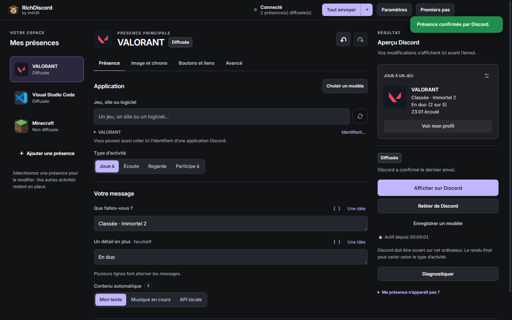
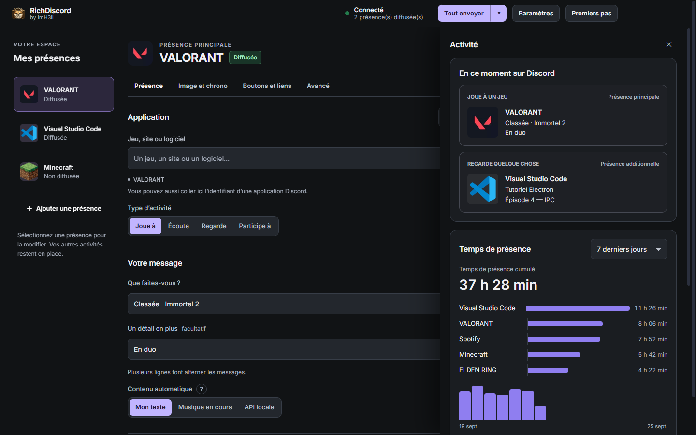
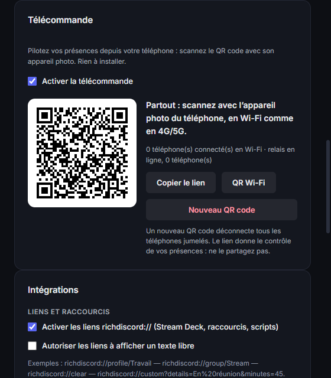
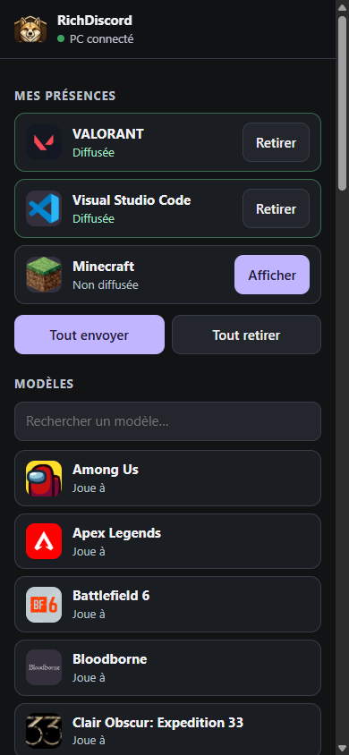
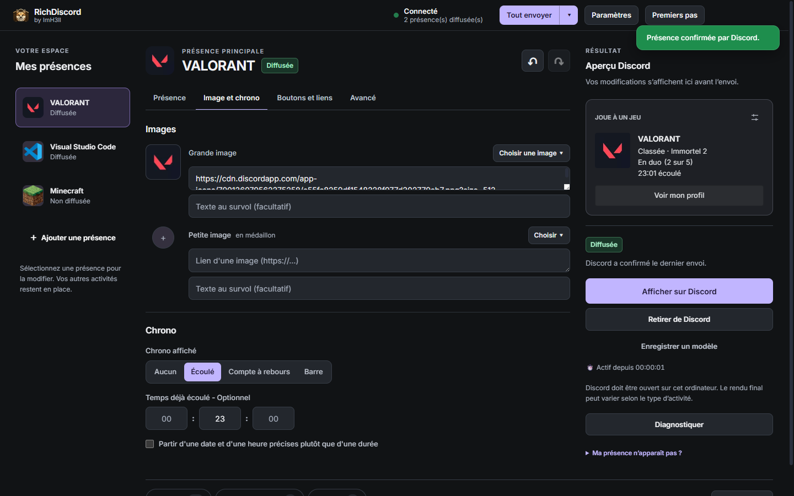
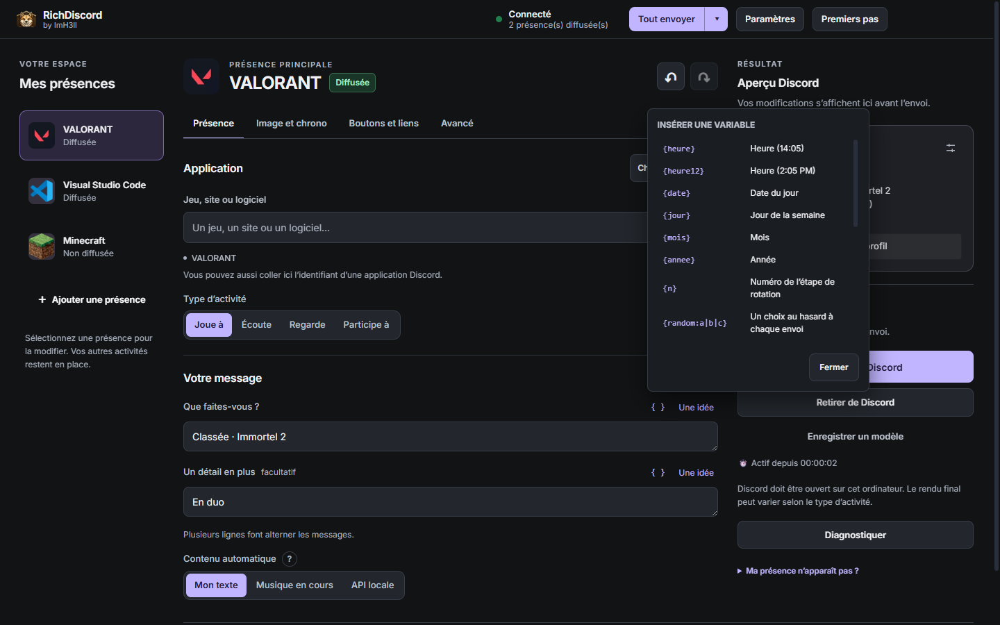
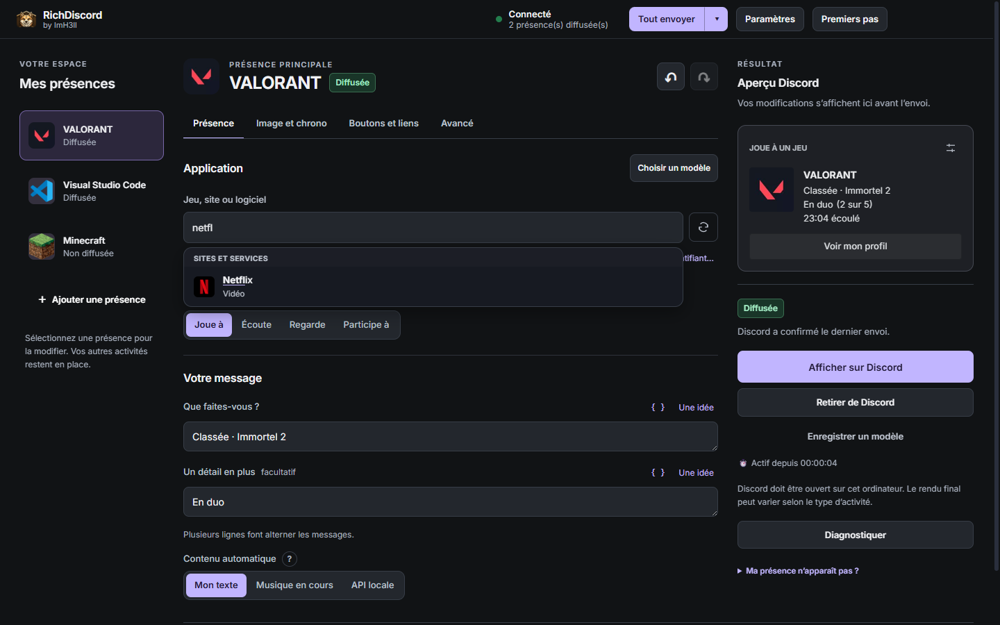
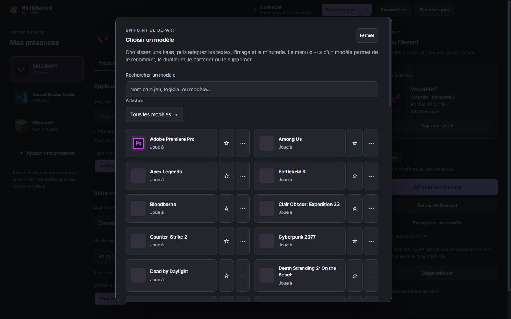
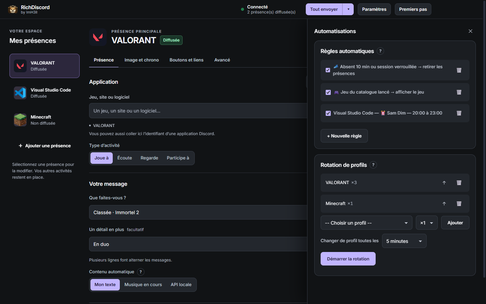

<p align="center">
  
</p>

<h1 align="center">RichDiscord</h1>

<p align="center">
  <b>Composez votre statut Discord comme vous l'imaginez — et pilotez-le depuis votre téléphone.</b><br>
  Jeux, musique, séries, travail : une présence riche, animée et automatique, sans ligne de code.
</p>

<p align="center">
  <a href="https://github.com/ImH3ll/RichDiscord-Releases/releases/latest/download/RichDiscord-Setup-1.4.0.exe"><b>⬇️ Télécharger pour Windows</b></a>
  &nbsp;·&nbsp;
  <a href="https://github.com/ImH3ll/RichDiscord-Releases/releases/latest/download/RichDiscord-Portable-1.4.0.exe">Version portable</a>
</p>

---

## Ce que voient vos amis

RichDiscord remplit la carte « Joue à… » de votre profil Discord avec **ce que vous voulez** : le jeu,
deux lignes de texte, une image, un chrono, la taille de votre groupe et jusqu'à deux boutons cliquables.

> **VALORANT**
> Classée · Immortel 2
> En duo (2 sur 5) · 23:00 écoulé
> [ Voir mon profil ]

L'aperçu à droite de l'atelier montre la carte **exactement comme Discord l'affichera**, avant l'envoi.

---

## 🎮 Plusieurs présences à la fois

Affichez un jeu **et** ce que vous regardez **et** votre musique, en même temps. Chaque présence a son
propre éditeur ; un double-clic dans la liste l'affiche ou la retire, un clic droit ouvre ses actions.
« Tout envoyer » publie tout d'un coup.

<p align="center"></p>

---

## 📱 La télécommande : votre statut depuis le téléphone

Paramètres → **Télécommande** → scannez le QR code avec l'appareil photo. C'est tout : **rien à installer**.

<table>
<tr>
<td width="55%"></td>
<td></td>
</tr>
</table>

- Choisissez un modèle d'un doigt : il s'affiche sur Discord dans la seconde
- Affichez ou retirez chaque présence, ou tout d'un coup
- **À la maison comme en 4G/5G**
- **Chiffré de bout en bout** : la clé ne quitte jamais le QR code, le relais ne voit rien passer
- Ajoutez la page à l'écran d'accueil : elle se comporte comme une app

*Exemple : vous quittez le PC pour la soirée → sur le téléphone, « Tout retirer ». Vous lancez une partie
chez un ami → touchez « VALORANT ».*

---

## ✏️ Un atelier simple et complet

Quatre onglets, rien de caché : **Présence**, **Image et chrono**, **Boutons et liens**, **Avancé**.
Choisir « Écoute », « Regarde » ou « Participe à » se fait d'un clic ; un point rouge signale l'onglet à corriger.

<p align="center"></p>

- **Images** : depuis le PC, créées par IA, déjà utilisées, ou celles de l'application en un clic
- **Chrono** : temps écoulé, compte à rebours, ou barre de progression comme Spotify
- **Rotation** : écrivez plusieurs lignes, elles défilent toutes seules sur Discord
- **Annuler / Rétablir** (Ctrl+Z) et retour à la version affichée sur Discord

### Des textes vivants avec les variables

Le bouton **{ }** insère une variable, remplacée à chaque envoi :

<p align="center"></p>

| Vous écrivez | Discord affiche |
|---|---|
| `Il est {heure}, toujours debout` | Il est 01:42, toujours debout |
| `Session depuis {allume}` | Session depuis 3 h 12 min |
| `Humeur : {random:concentré\|en feu\|tilté}` | Humeur : en feu |
| `♪ {titre} — {artiste}` | ♪ Blinding Lights — The Weeknd |
| `Score : {fichier:score}` | Score : 12 - 4 *(lu dans un fichier, pour OBS ou un jeu)* |

---

## 🔎 Plus de 24 000 jeux et 1 272 services

La recherche connaît tous les jeux reconnus par Discord **et** les sites du quotidien : Spotify, Netflix,
YouTube, Twitch, Disney+… Elle pardonne les fautes (« netflx » trouve Netflix) et règle le bon verbe.

<p align="center"></p>

Et une cinquantaine de **modèles prêts à l'emploi**, à mettre en favori, renommer, dupliquer ou partager
par un simple code :

<p align="center"></p>

---

## 🤖 Il s'occupe de tout, même quand vous oubliez

<p align="center"></p>

| Règle | Ce qui se passe |
|---|---|
| **Absent** | Vous quittez le PC 10 min (ou verrouillez la session) → vos présences disparaissent, puis reviennent à votre retour |
| **Jeu lancé** | Vous démarrez un jeu → il s'affiche avec son nom et son image officiels |
| **Horaire** | Du lundi au vendredi, 9 h – 18 h → « Visual Studio Code » |
| **Programme** | `obs64.exe` tourne → « En live » ; il se ferme → statut effacé |
| **Rotation de profils** | VALORANT ×3, Minecraft ×1 → changement toutes les 5 minutes |

Et aussi : **musique en cours** détectée sous Windows (Spotify, navigateurs, Apple Music…) avec pochette et
vraie progression, **extension navigateur** pour YouTube et Twitch, **liens `richdiscord://`** pour un
Stream Deck, retour automatique après une mise en veille.

---

## 🔒 Respect de votre compte et de votre vie privée

- Passe par la fonction officielle de Discord de bureau : **pas de selfbot, pas de jeton de compte**, aucun risque de bannissement lié à l'app
- Profils, historique et statistiques restent **sur votre PC** ; pas de télémétrie
- Télécommande désactivée par défaut, chiffrée de bout en bout, révocable en un clic
- Mises à jour intégrées, vérifiées par empreinte, **installées seulement quand vous le décidez**

---

## ⬇️ Installer

1. Téléchargez **[RichDiscord-Setup-1.4.0.exe](https://github.com/ImH3ll/RichDiscord-Releases/releases/latest/download/RichDiscord-Setup-1.4.0.exe)** et lancez-le.
2. Ouvrez **Discord de bureau** (l'appli, pas le navigateur).
3. Choisissez un modèle, personnalisez-le, cliquez sur **Afficher sur Discord**.

Windows 10/11 64 bits. L'exécutable n'est pas encore signé : si Windows affiche « Windows a protégé votre
ordinateur », cliquez sur *Informations complémentaires* → *Exécuter quand même*.

<details>
<summary>Empreintes SHA-256 de la 1.4.0</summary>

```
5ae8fd1e15f518c89d40a7abacc81742b10601fbc1e67c538cb31539088901d3  RichDiscord-Setup-1.4.0.exe
46a41ce809a755124caa84b7a28780c5ef2d56febed3d65013fea44f47527205  RichDiscord-Portable-1.4.0.exe
6bf3ef48e6fbca377ee78ec6bd803f0616c832fe04562a9106308974ef6f1197  RichDiscord-Setup-1.4.0.exe.blockmap
b2676a1f00435b674178fc38e84910b03b33ef5d1e96aaf4d5b9480e85783ef3  latest.yml
```
</details>

<p align="center"><sub>RichDiscord by ImH3ll · Captures réalisées avec des données de démonstration.</sub></p>
