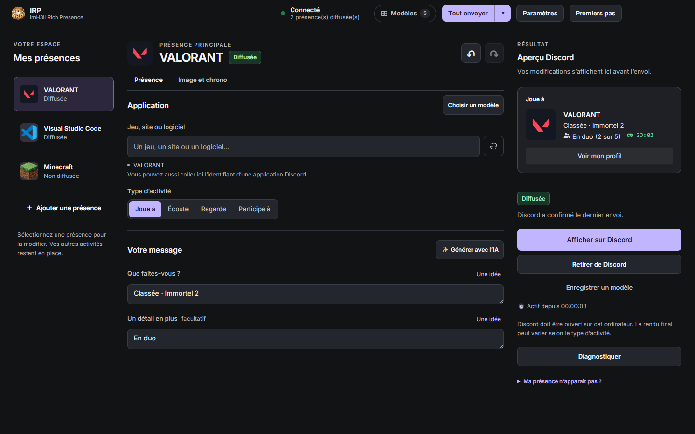

<p align="center">
  
</p>

<h1 align="center">IRP — ImH3ll Rich Presence</h1>

<p align="center">
  <b>Composez votre statut Discord comme vous l'imaginez — et pilotez-le depuis votre téléphone.</b><br>
  Jeux, séries, musique, travail : une présence riche, animée et automatique, sans ligne de code.
</p>

<p align="center">
  <a href="https://github.com/ImH3ll/IRP-Releases/releases/latest"><b>⬇️ Télécharger pour Windows</b></a>
  &nbsp;·&nbsp; gratuit &nbsp;·&nbsp; Windows 10/11 &nbsp;·&nbsp; <i>anciennement RichDiscord</i>
</p>

<p align="center">
  
</p>

---

## Ce que voient vos amis

IRP remplit la carte « Joue à… » de votre profil Discord avec **ce que vous voulez** : le jeu, deux lignes
de texte, une image, un chrono, la taille de votre groupe et jusqu'à deux boutons cliquables.

> **VALORANT**
> Classée · Immortel 2
> En duo (2 sur 5) · 23:00 écoulé
> [ Voir mon profil ]

L'aperçu à droite montre la carte **exactement comme Discord l'affichera**, avant l'envoi.

---

## ✨ En trois gestes

1. **Cherchez votre jeu** : parmi plus de 24 000 jeux reconnus par Discord, les plus joués en premier.
   Les fautes et les sigles passent (« gta 5 », « lol », « cs2 »).
2. **Écrivez votre message** (en panne d'idée ? un bouton vous en propose une).
3. **Afficher sur Discord**. C'est tout.

<p align="center"></p>

---

## 🎮 Plusieurs présences à la fois

Affichez un jeu **et** ce que vous regardez **et** votre musique, en même temps. Chaque présence a son propre
éditeur ; glissez-les dans la liste pour choisir leur ordre, double-cliquez pour les afficher ou les retirer.
« Tout envoyer » publie tout d'un coup.

<p align="center"></p>

> Discord montre aux autres **les 5 premières présences envoyées** (vous en voyez jusqu'à 99 sur votre
> profil) : IRP marque les suivantes « toi seul », pour que vous sachiez toujours ce que voient vos amis.

---

## 📱 La télécommande : votre statut depuis le téléphone

Paramètres → **Télécommande** → scannez le QR code avec l'appareil photo. **Rien à installer.**

<table>
<tr>
<td width="55%"></td>
<td></td>
</tr>
</table>

- Affichez ou retirez chaque présence, ou tout d'un coup
- Envoyez un **groupe** de présences d'un seul doigt, réordonnez-les en les faisant glisser
- **À la maison comme en 4G/5G**
- **Chiffré de bout en bout** : la clé ne quitte jamais le QR code, le relais ne voit rien passer
- Ajoutez la page à l'écran d'accueil : elle se comporte comme une app

---

## 🧭 Simple par défaut, complet quand vous voulez

IRP s'ouvre en **mode simple** : le jeu, le message, l'image, le chrono. Tout le reste attend dans le
**mode avancé** (Paramètres → Affichage) :

<p align="center"></p>

- **Images** : depuis le PC, créées par IA, déjà utilisées, ou celles de l'application en un clic
- **Chrono** : temps écoulé, compte à rebours, ou barre de progression comme Spotify
- **Boutons et liens cliquables** sur les textes et les images
- **Rotation** : plusieurs lignes qui défilent, chacune avec sa durée (`❤️ {10s}` en fin de ligne) ; images
  et liens peuvent tourner aussi
- **Annuler / Rétablir** (Ctrl+Z) et retour à la version affichée sur Discord

<p align="center"></p>

### Des textes vivants avec les variables

Le bouton **{ }** insère une variable, remplacée à chaque envoi :

<p align="center"></p>

| Vous écrivez | Discord affiche |
|---|---|
| `Il est {heure}, toujours debout` | Il est 01:42, toujours debout |
| `Session depuis {allume}` | Session depuis 3 h 12 min |
| `Humeur : {random:concentré\|en feu\|tilté}` | Humeur : en feu |
| `♪ {titre} — {artiste}` | ♪ Blinding Lights — The Weeknd |
| `Score : {fichier:score}` | Score : 12 - 4 *(lu dans un fichier, pour OBS ou un jeu)* |

### Vos modèles et vos groupes

Enregistrez une présence comme **modèle**, ou tout un ensemble comme **groupe** : un clic pour les
retrouver, à mettre en favori, renommer, dupliquer ou partager par un simple code.

<p align="center"></p>

---

## 🤖 Il s'occupe de tout, même quand vous oubliez

<p align="center"></p>

| Règle | Ce qui se passe |
|---|---|
| **Absent** | Vous quittez le PC 10 min (ou verrouillez la session) → vos présences disparaissent, puis reviennent à votre retour |
| **Jeu lancé** | Vous démarrez un jeu → il s'affiche avec son nom et son image officiels |
| **Horaire** | Du lundi au vendredi, 9 h – 18 h → « Visual Studio Code » |
| **Programme** | `obs64.exe` tourne → « En live » ; il se ferme → statut effacé |
| **Rotation de profils** | VALORANT ×3, Minecraft ×1 → changement toutes les 5 minutes |

Et aussi : **musique en cours** détectée sous Windows (Spotify, navigateurs, Apple Music…) avec pochette et
vraie progression, **extension de navigateur** pour YouTube et Twitch, **liens `richdiscord://`** pour un
Stream Deck, retour automatique après une mise en veille. Un guide pas à pas est intégré dans les Paramètres.

---

## 🔒 Respect de votre compte et de votre vie privée

- Passe par la fonction officielle de Discord de bureau : **pas de selfbot, pas de jeton de compte**, aucun
  risque de bannissement lié à l'app
- Modèles, historique et statistiques restent **sur votre PC** ; pas de télémétrie
- Télécommande désactivée par défaut, chiffrée de bout en bout, révocable en un clic
- Mises à jour intégrées, vérifiées par empreinte, **installées seulement quand vous le décidez**

---

## ⬇️ Installer

1. Sur la **[page des versions](https://github.com/ImH3ll/IRP-Releases/releases/latest)**, téléchargez
   **`IRP-Setup-x.y.z.exe`** et lancez-le (ou **`IRP-Portable-x.y.z.exe`** pour une version sans installation).
2. Ouvrez **Discord de bureau** (l'appli, pas le navigateur).
3. Cherchez votre jeu, écrivez votre message, cliquez sur **Afficher sur Discord**.

Windows 10/11 64 bits. L'exécutable n'est pas encore signé : si Windows affiche « Windows a protégé votre
ordinateur », cliquez sur *Informations complémentaires* → *Exécuter quand même*.

Vous aviez RichDiscord ? Installez IRP par-dessus : vos modèles, groupes et réglages sont conservés.

### Extension de navigateur (facultatif)

Téléchargez **`IRP-Extension-x.y.z.zip`** sur la même page, décompressez-le, puis suivez le guide intégré :
Paramètres → Intégrations avancées → *Comment ça marche ?*

### Désinstaller

Paramètres Windows → Applications → IRP → Désinstaller. Le désinstalleur retire aussi le lancement au
démarrage, le cache des mises à jour, puis **vous demande** s'il faut effacer vos modèles et réglages
(Non = vous les retrouvez en réinstallant).
Version portable : supprimez l'exe, et le dossier `%APPDATA%\RichDiscord` si vous voulez tout effacer.

<details>
<summary>Empreintes SHA-256 de la 1.4.0</summary>

```
37aea1b25f0adcd4133312bd37ad1bc96aed3c8b4c25d584b5d9600fc0f8564d  IRP-Setup-1.4.0.exe
ee533031e872cb442974bb7161fb184499907c41626d3a9d257a0e0d1dd53fa3  IRP-Portable-1.4.0.exe
5f14ef139059564b03185395a308f55601ba5264e10aa4c3179f9338d324ca41  IRP-Setup-1.4.0.exe.blockmap
c0a9107eb55b52a60c91df64363e3b7e94d9eee1ba488fd77da5772867d7f347  latest.yml
cc5ef16fc7a076bde7f29daef4f9868ffa59905693be293f5fe99e45248af026  IRP-Extension-1.4.0.zip
```
</details>

---

<p align="center"><sub>IRP by ImH3ll · © 2026 ImH3ll, tous droits réservés · gratuit pour un usage personnel ·
projet indépendant, sans affiliation avec Discord · captures réalisées avec des données de démonstration.</sub></p>
